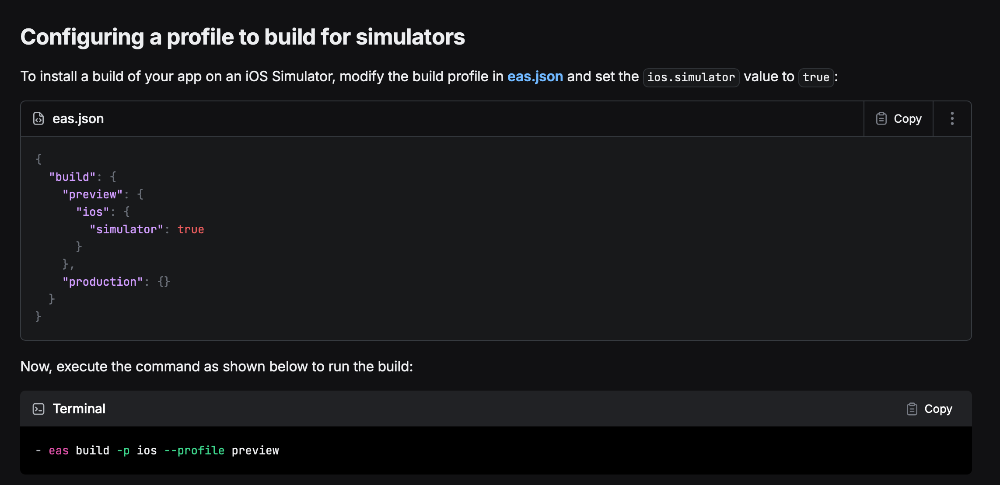

# Expo Build Upload Example

## Quick Setup

1. Copy `upload-only-expo.yml` to `.github/workflows/` in your repository
2. Update `BUILD_VAR_ID` (marked with 📝 comments)
3. Add secrets to your GitHub repository
4. Push to trigger the workflow

## What It Does

- Builds iOS app with Expo EAS (15-20 minutes)
- Converts .tar.gz to .zip format automatically
- Uploads to Revyl with CI/CD metadata
- Returns version-id for future testing

## Required Setup

### 1. GitHub Secrets

Add to your repository secrets (`Settings` → `Secrets and variables` →
`Actions`):

| Secret          | Where to get it                                                              | Purpose                     |
| --------------- | ---------------------------------------------------------------------------- | --------------------------- |
| `REVYL_API_KEY` | [Revyl Settings](https://auth.revyl.ai/account/api_keys)                     | Authenticate with Revyl API |
| `EXPO_TOKEN`    | [Expo Settings](https://expo.dev/accounts/[username]/settings/access-tokens) | Download builds from EAS    |

### 2. Update Configuration

In the workflow file, update:

```yaml
BUILD_VAR_ID: 'your-build-variable-id-here' # Get from Revyl dashboard
```

### 3. EAS Build Profile

**IMPORTANT:** Your EAS build profile must be configured for **simulator
builds**.



Make sure your `eas.json` profile has:

```json
{
  "build": {
    "preview": {
      "ios": {
        "simulator": true
      }
    }
  }
}
```

## Troubleshooting

**"Missing REVYL_API_KEY"** - Add the secret to your repository  
**"Build variable not found"** - Update BUILD_VAR_ID and create build variable
in Revyl  
**"Failed to get build URL"** - Check EXPO_TOKEN and EAS credits  
**"Expo URL download failed"** - Verify EXPO_TOKEN has access to your builds
